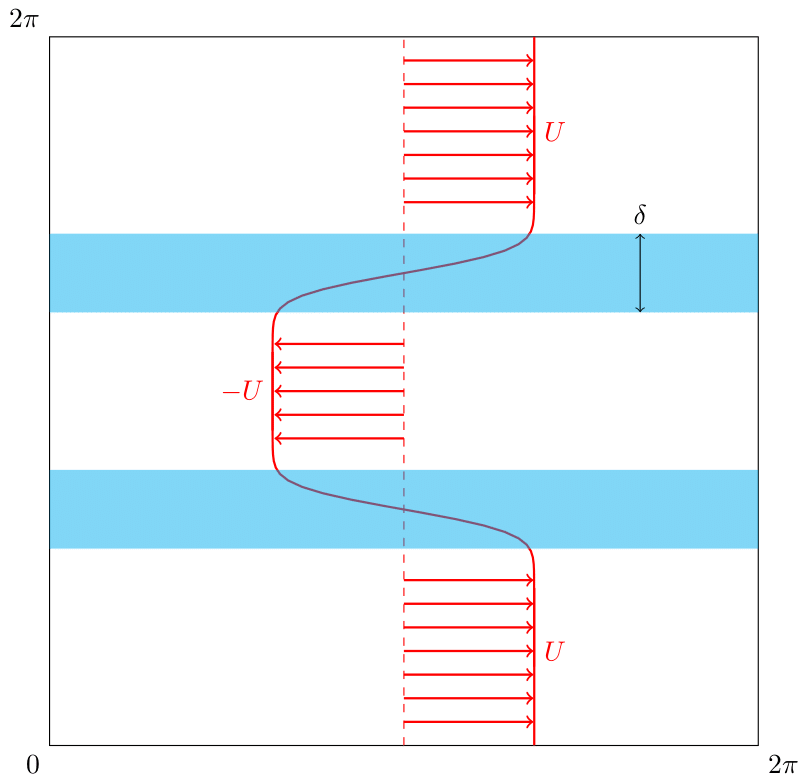

## Instabilité de Kelvin-Helmholtz

L'instabilité de Kelvin-Helmholtz se produit à l'interface entre deux fluides se déplaçant à des vitesses différentes. Cette instabilité se caractérise par la formation de tourbillons en spirale caractéristiques, que l'on peut observer dans la nature, par exemple dans les nuages ou à la surface des océans.

### Configuration initiale

Le système est initialisé avec deux couches de fluide séparées par une couche de cisaillement d'épaisseur $\delta$ :
- Une couche centrale avec une vitesse négative $-U$
- Une couche extérieure avec une vitesse positive $U$

    

Pour initier les couches de cisaillement on prendra une vitesse initiale s'écrivant :

$$
\begin{aligned}
    \begin{cases} 
        u(x,y,0) = U erf \left( \frac{y}{\delta} \right) + u'(x,y)\\
        v(x,y,0) = v'(x,y)
    \end{cases}
\end{aligned}
$$

avec $u'$ et $v'$ qui correspond à une perturbation afin d'initier l'instabilité ($u',v'<<U$) et $erf(s)$ la fonction erreur (fonction impaire) qui s'écrit 

$$
    erf(s)=\frac{2}{\sqrt{\pi}} \int_0^s e^{-s^2}ds
$$

avec la définition de la vorticité en 2D, on peut trouver la vorticité initial :

$$
    \omega(x,y,0) = - \frac{U}{\delta} \frac{2}{\sqrt{\pi}} e^{-\left( \frac{y}{\delta} \right)^2} + \omega'(x,y)
$$

    
Démonstration

On part de la définition de la vorticité en 2D :

$$
    \omega = \frac{\partial v}{\partial x} - \frac{\partial u}{\partial y}
$$

Comme $v' << U$, on peut négliger $\frac{\partial v}{\partial x}$. La dérivé de la fonction erreur s'écrit : 

$$
    \frac{d}{ds} erf(s) = \frac{2}{\sqrt{\pi}} e^{-s^2}
$$

En faisant le changement de variable suivant $s=\frac{y}{\delta}$ on peut trouver le champ de vorticité initial :

$$
    \begin{aligned}
    \omega &= - \frac{\partial u}{\partial y} = - U \frac{d}{dy}erf(\frac{y}{\delta}) - \frac{\partial u'}{\partial y}\\
    &= -\frac{U}{\delta} \frac{d}{ds}erf(s) + \omega'
    \end{aligned}
$$

On obtient donc :

$$
    \omega(x,y,0) = -\frac{U}{\delta} \frac{2}{\sqrt{\pi}} e^{-(\frac{y}{\delta})^2} + \omega'(x,y)
$$

### Adimensionnement

On doit adimensionner la condition initiale. Pour cela, on introduit les mêmes grandeurs caractéristiques que pour l'[adimensionnement des équations de Navier-Stokes](./démonstration_NS.md#adimensionnement) :

- $L$ : longueur caractéristique
- $U$ : vitesse caractéristique

Les variables adimensionnées sont définies par :
$$
\begin{aligned}
    \tilde{x} &= \frac{1}{L}x \\
    \tilde{y} &= \frac{1}{L}y \\
    \tilde{\delta} &= \frac{1}{L}\delta \\
    \tilde{k} &= kL \\
    \tilde{\omega} &= \frac{L}{U}\omega
\end{aligned}
$$

Ainsi, la forme adimensionnée de la condition initiale s'écrit : 

$$
    \tilde{\omega}(\tilde{x},\tilde{y},0) = -\frac{1}{\tilde{\delta}} \frac{2}{\sqrt{\pi}} e^{-(\frac{\tilde{y}}{\tilde{\delta}})^2} + \tilde{\omega'}(\tilde{x},\tilde{y})
$$

### Types de perturbations

#### 1. Perturbation aléatoire

La première approche consiste à introduire une perturbation aléatoire dans le système. L'équation de la vorticité initiale devient :

$$
    \tilde{\omega}(\tilde{x},\tilde{y},0) = -\frac{1}{\tilde{\delta}} \frac{2}{\sqrt{\pi}} e^{-(\frac{\tilde{y}}{\tilde{\delta}})^2} + \epsilon \tilde{\omega'}(\ {x},\tilde{y})
$$

**Paramètres de simulation :**
- Intensité de la perturbation : $\epsilon = 0.01$
- Épaisseur de cisaillement : $\tilde{\delta} = 0.025$
- Nombre de Reynolds : $Re = 2000$
- Durée de simulation : 30 secondes

    

        <h3 style="text-align: center;">magnitude de la vorticité</h3>
        <video src="../video/KH_random/vorticity_mag.mp4" width="500" height="500" controls>
        </video>
    

    

        <h3 style="text-align: center;">vorticité selon z</h3>
        <video src="../video/KH_random/vorticity_z.mp4" width="500" height="500" controls>
        </video>
    

    
Autres grandeurs physiques

    

        <h3 style="text-align: center;">fonction de courant</h3>
        <video src="../video/KH_random/streamfunction.mp4" width="500" height="500" controls>
        </video>
    

    

        <h3 style="text-align: center;">magnitude de la vitesse</h3>
        <video src="../video/KH_random/velocity_mag.mp4" width="500" height="500" controls>
        </video>
    

    

        <h3 style="text-align: center;">vitesse selon x</h3>
        <video src="../video/KH_random/velocity_x.mp4" width="500" height="500" controls>
        </video>
    

    

        <h3 style="text-align: center;">vitesse selon y</h3>
        <video src="../video/KH_random/velocity_y.mp4" width="500" height="500" controls>
        </video>
    

#### 2. Perturbation sinusoïdale 

La seconde approche utilise une perturbation sinusoïdale contrôlée. Cette méthode permet une étude plus systématique de l'instabilité.

**Paramètres de simulation :**
- Amplitude : $A = 0.1$
- Nombre d'onde : $\tilde{k} = 4$
- Autres paramètres identiques à la simulation précédente

$$
  \tilde{\omega}(\tilde{x},\tilde{y},0) = -\frac{1}{\tilde{\delta}} \frac{2}{\sqrt{\pi}} e^{-(\frac{\tilde{y}}{\tilde{\delta}})^2} + A \sin(\tilde{k} \tilde{x})
$$

    

        <h3 style="text-align: center;">magnitude de la vorticité</h3>
        <video src="../video/KH_sinus/vorticity_mag.mp4" width="500" height="500" controls>
        </video>
    

    

        <h3 style="text-align: center;">vorticité selon z</h3>
        <video src="../video/KH_sinus/vorticity_z.mp4" width="500" height="500" controls>
        </video>
    

    
Autres grandeurs physiques

    

        <h3 style="text-align: center;">fonction de courant</h3>
        <video src="../video/KH_sinus/streamfunction.mp4" width="500" height="500" controls> 
        </video>
    

    

        <h3 style="text-align: center;">magnitude de la vitesse</h3>
        <video src="../video/KH_sinus/velocity_mag.mp4" width="500" height="500" controls>
        </video>
    

    

        <h3 style="text-align: center;">vitesse selon x</h3>
        <video src="../video/KH_sinus/velocity_x.mp4" width="500" height="500" controls>
        </video>
    

    

        <h3 style="text-align: center;">vitesse selon y</h3>
        <video src="../video/KH_sinus/velocity_y.mp4" width="500" height="500" controls>
        </video>
    

